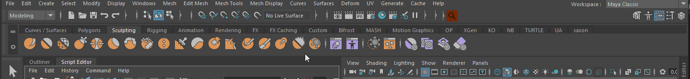
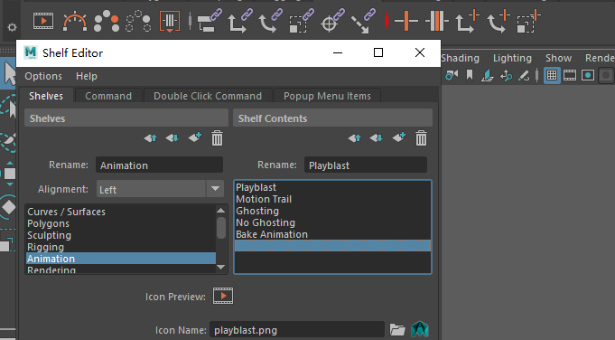
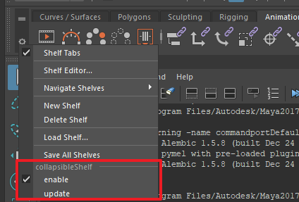
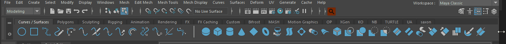

# CollapsableShelf
Maya 工具架的可伸缩分隔符 [博客说明](https://blog.l0v0.com/posts/204db704.html)



## 安装 

安装步骤和我另一个 [mpdb](https://github.com/FXTD-ODYSSEY/mpdb) 插件一致，步骤如下：

1. 在 Github 上下载发布的插件压缩包 （或者将 release 分支克隆到本地）
2. 将压缩包解压到任意路径上（建议路径保持全英文）(如果是克隆分支的不需要解压操作)
3. 将 install.mel 拖拽到 Maya 的视窗上 

安装完成之后会自动将工具架上的所有分割符切换为可伸缩的分隔符

## 使用注意



分割符切换之后就无法正常修改图标的属性了，因此我添加了回复原样的选项
另外退出软件自动保存工具架如果不回复原样的话会导致伸缩分隔符的图标全部丢失，不过也不必担心，我已经做了退出事件的监听，确保退出程序的时候复原工具架再保存的。



点击 enable 的复选框可以自由切换。
点击 update 则可以重新更新工具架上的数据。

---



伸缩状态下需要注意伸缩组件的宽度，如果软件的宽度不够会移动到下方~


## 分割符配置选项

mel 的 separator 无法通过 Maya 来直接添加到工具架上，需要借助 mel 语言来操作。
在 [我的文档]/maya/[version]/pref/shelves/ 有对应工具架生成的 mel 脚本
可以通过修改脚本来添加 separator ， separator 的参数可以参考官方默认工具架。

---

separator 的参数上我也加入了一些特殊参数的设置来让 伸缩按钮具备一定的可控性。

-docTag 参数传入 "{tooltip};{color}" 就会将前面的字符串转换为按钮的提示 后面的字符串转换为 颜色参数
-annotation 参数则 直接设置下方的 status 显示

参考如下
```mel
separator
    -enable 1
    -docTag "tooltip example;red" // 按钮会显示 "tooltip example" 并且呈现红色 - 颜色字符参考 css 样式表支持的颜色
    -annotation "status example" // 下方的状态栏显示 "status example"
    -width 34
    -height 35
    -manage 1
    -visible 1
    -preventOverride 0
    -enableBackground 0
    -highlightColor 0.321569 0.521569 0.65098 
    -style "shelf" 
    -horizontal 0
;

separator
    -enable 1
    -docTag "tooltip example;0,255,0" // 颜色也可以传入 三位 0-255 的数字表示
    -width 34
    -height 35
    -manage 1
    -visible 1
    -preventOverride 0
    -enableBackground 0
    -highlightColor 0.321569 0.521569 0.65098 
    -style "shelf" 
    -horizontal 0
;
```

# todolist

- [x] toggle 组件
- [x] 复原功能
- [x] scriptJob 退出 Maya 自动复原
- [x] 附加选项到 option 按钮
- [x] tooltip 更加 separator doctag
- [x] 记录颜色